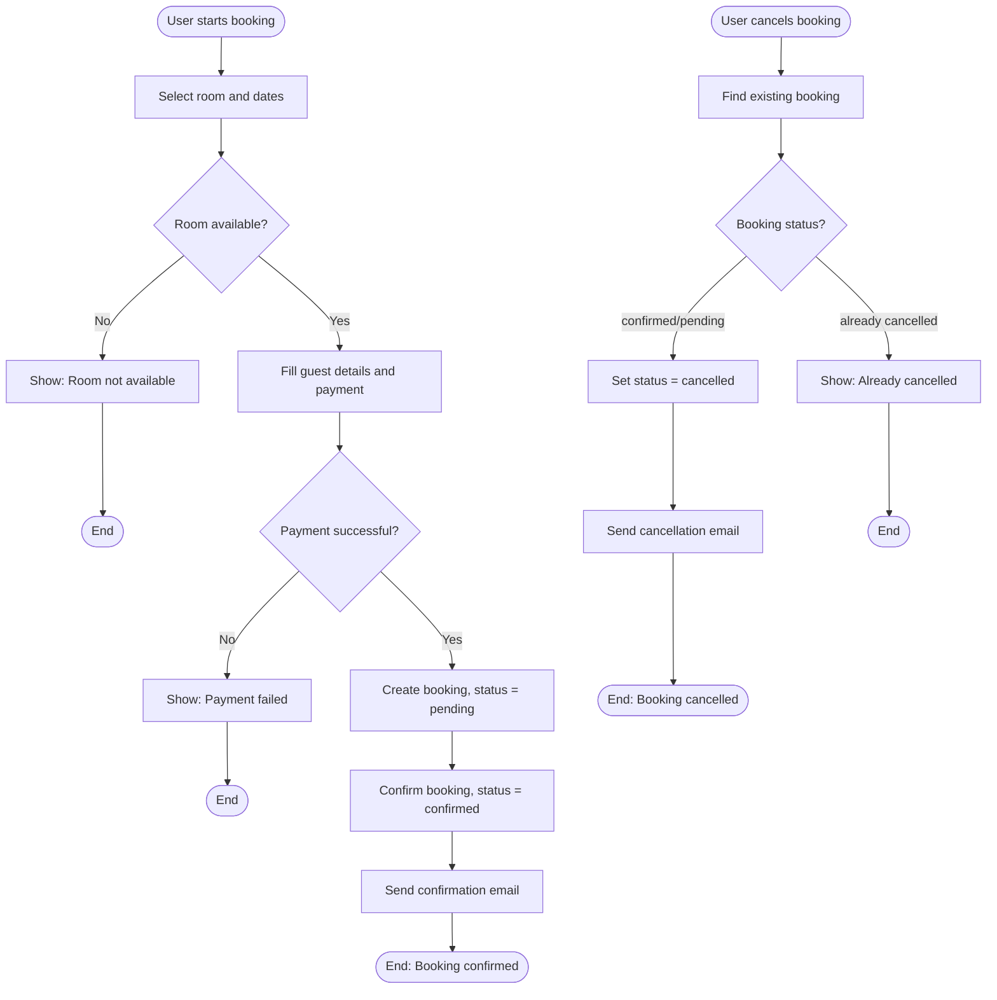
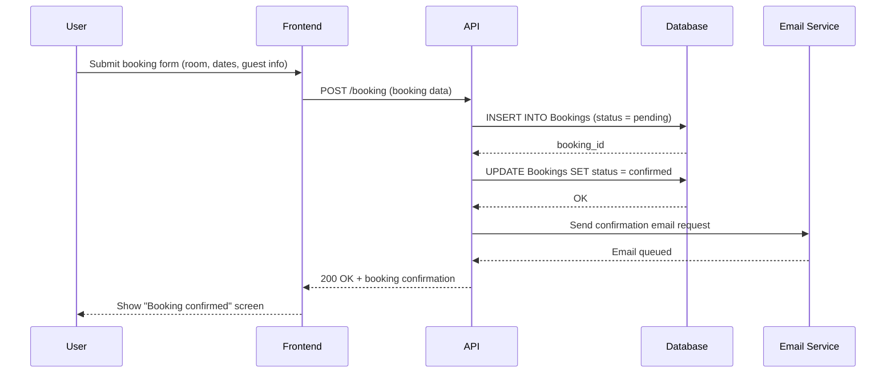
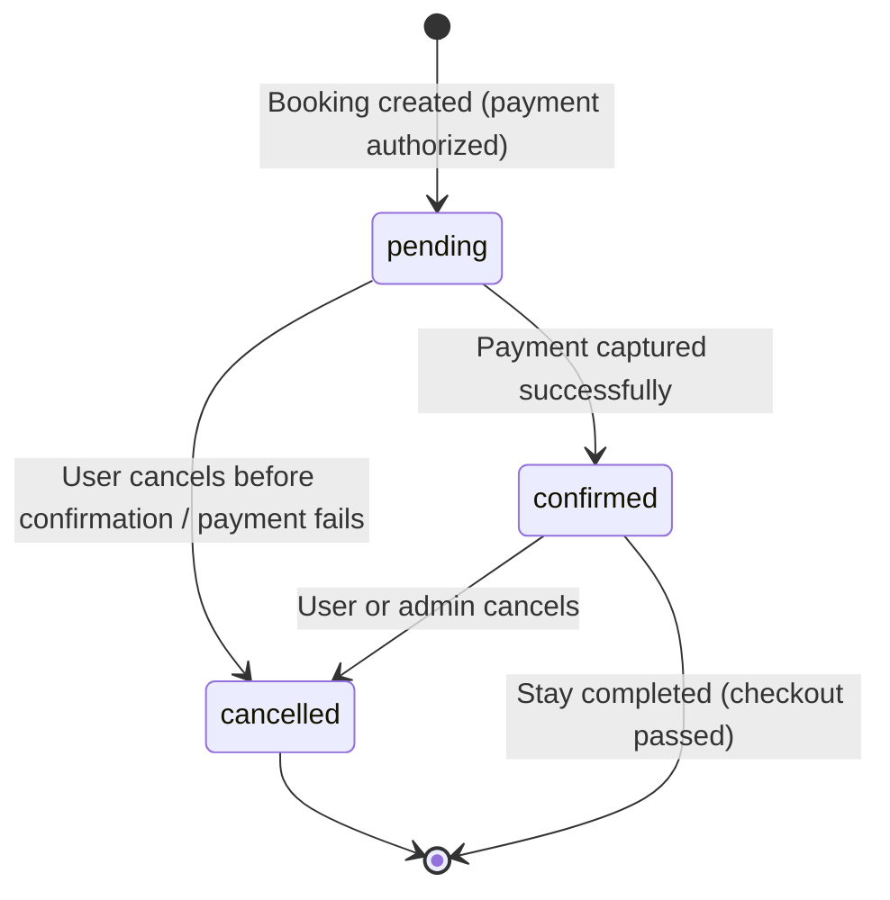

# Booking Process Diagrams

## 1. Booking Flow (BPMN-style) — Happy Path + Exceptions

**Happy path:** Select room → fill details → pay → booking created (pending) → confirmed → email sent.

**Exception 1:** Room unavailable — process stops, user is notified before any data is created.

**Exception 2:** Payment fails — booking is not created, status never enters the system; this prevents orphaned bookings.

---

## 2. Sequence Diagram — Booking Creation

---

## 3. State Transition — Booking Object

### Transitions that MUST be covered by tests:

- **[*] → pending** — verify a new booking is created with the correct default status, and that required fields (user_id, room_id, checkin, checkout) are validated.
- **pending → confirmed** — verify that confirmation only happens after successful payment, and that `status` field updates correctly in the database.
- **pending → cancelled** — verify cancellation is possible before confirmation and that the room becomes available again for other users.
- **confirmed → cancelled** — verify cancellation of an already-confirmed booking is possible, the room is freed, and a cancellation email is triggered.
- **cancelled → (any)** — verify the system does NOT allow re-confirming a cancelled booking (this is the most likely place for bugs — boundary of an invalid transition).

This matters for QA because invalid transitions (e.g. confirming an already-cancelled booking, or double-confirming) are a very common source of real bugs in booking systems — explicit negative tests should target exactly these transitions.
